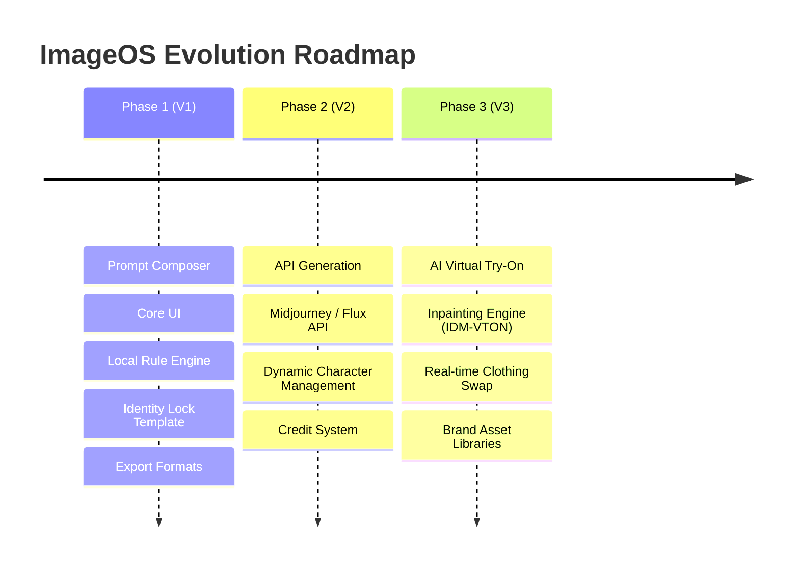

# AI ImageOS - 01 Vision Document
**Version:** 1.0 (PRO Edition)  
**Author:** Lead Product Architect & Director of Creative Operations  

---

## 1. Executive Summary

AI ImageOS is a professional **Visual Direction Operating System** designed to eliminate prompt engineering complexity while guaranteeing maximum character identity preservation. 

Unlike standard text-to-image generators or chat-based prompt builders, AI ImageOS functions like a digital photography studio. The user acts as the Creative Director, making modular choices about lighting, cameras, location, wardrobe, and composition, while the platform programmatically compiles production-ready prompts that work with modern AI image generators (Midjourney, Flux, Stable Diffusion).

---

## 2. Problem Statement

Modern AI image workflows are fragmented and inefficient. The primary friction points are:

1.  **Identity Drift:** The moment a user changes the environment, pose, or lighting, the character's facial structure, age, and features change. Maintaining a single character across multiple scenes is nearly impossible for non-technical users.
2.  **Terminology Gap:** Most creators do not understand photography (e.g., lens compression, 85mm portrait lenses vs. 24mm wide-angle lenses), lighting (e.g., golden hour, Rembrandt lighting, soft boxes), or materials rendering (e.g., matte stretch fabric, silk texture folds). Consequently, they write poor prompts.
3.  **Prompt Conflict:** Users frequently write contradictory descriptions (e.g., "bright midday sun" at "night", or "85mm close-up" with a "wide-angle landscape view"), which confuses AI models and wastes rendering credits.
4.  **No Structure:** Prompts are written as unorganized blocks of text, leading to unpredictable AI interpretations.

---

## 3. Product Vision & Positioning

### Mission
To bridge the gap between creative imagination and AI image generation by replacing manual prompt writing with structured visual decisions, preserving character identity 100% across all scenes.

### Product Positioning (What We Are vs. What We Are Not)

| What We ARE | What We ARE NOT |
| :--- | :--- |
| A **Visual Direction Platform** | An AI Image Generator (in V1) |
| A **Deterministic Scene Builder** | An AI Chatbot |
| A **Professional Prompt Architect** | A generic Prompt Generator |
| A **Character Consistency Controller** | A simple Text Editor |

---

## 4. Competitive Advantage (The Moat)

1.  **Strict Identity Protection Framework:** A predefined, anatomically precise prompt chunk (Identity Lock) that stabilizes facial geometry, skin texture, and body proportions before adding environmental settings.
2.  **Domain-Specific Knowledge Base:** A proprietary database of professional terminology curated by cinematographers, fashion designers, and lighting directors.
3.  **Deterministic Rule & Compatibility Engine:** A validation layer that catches visual conflicts before the user copies or runs the prompt, reducing wasted credits and time.
4.  **Zero AI Overhead for Core Logic:** By using deterministic logic and local templates instead of running expensive LLMs to write prompts, the platform maintains a near-zero operational cost (unit-economics) in V1.

---

## 5. The Evolution Roadmap

*   **Phase 1 (Prompt Composer):** Build the foundation. Create the visual UI, rule validations, and prompt compiling engine. Users copy prompts and use them externally.
*   **Phase 2 (API Generation):** Connect third-party APIs (Flux, Replicate, Midjourney). Users generate images directly inside the platform without copy-pasting.
*   **Phase 3 (AI Virtual Try-On):** Integrate inpainting models (IDM-VTON, Stable Diffusion) to swap clothes dynamically on the model from the reference image, preserving the face and body geometry 100%.

---
